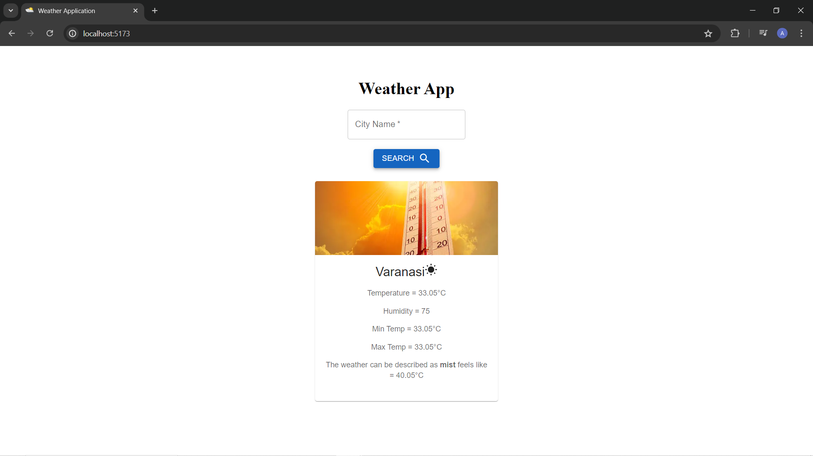

# Weather Application 

A simple React application to fetch and display real-time weather information. Enter a city name to get the current temperature, humidity, weather description, and other relevant details using the OpenWeatherMap API.

# Key features:

**Real-time temperature and weather information**

**Error handling for invalid city names**

**Responsive design with Material-UI components**